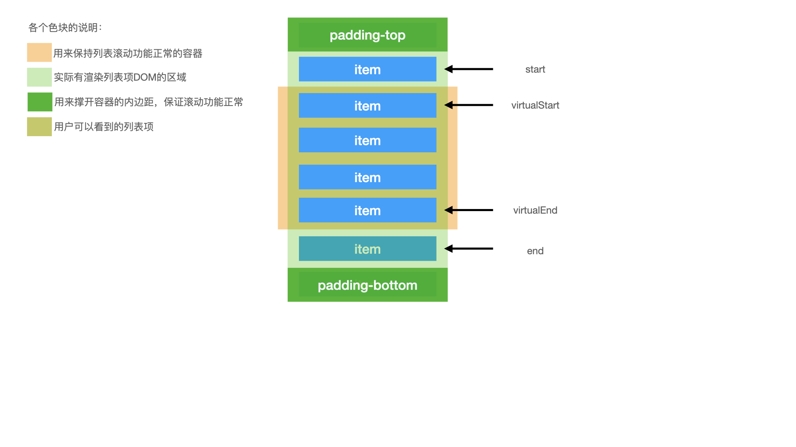
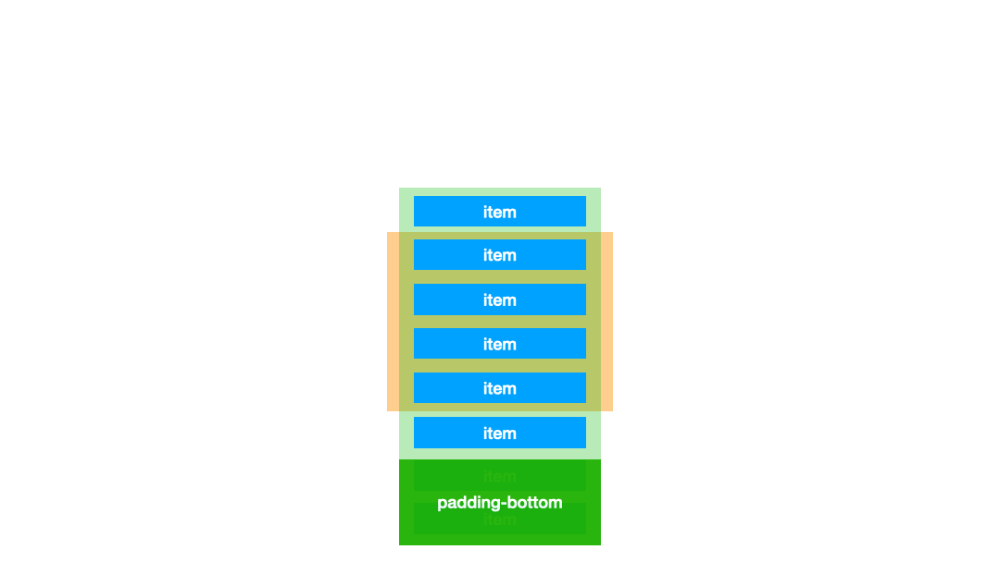

# l-virtualscrolling

因为网上能够很好解释原理的文章很少，所以做了这一个简单实现了虚拟滚动的demo，主要是为了理解并解释实现原理，并作一个记录。

虚拟滚动这个技术方案主要是为了解决页面列表因为数据量大而渲染出大量DOM导致页面卡顿的问题。通常情况下列表的高度是有限的，因此同时呈现给用户的数据是有限的，我们只需要将用户可以看到的数据渲染出来，对于用户看不到的数据，我们不需要进行渲染，这样就可以节省很多内存空间。

- 首先需要一个容器，这个容器是用来保持列表的滚动功能可以正常使用的
- 容器里面存放的就是我们列表，列表项放在列表中，但这个列表并不是普通的列表，这个列表的高度是固定的，因为我们只需要渲染固定数量的列表项。所以接下来就出现了两个问题。
- 那么为什么容器会出现滚动条？答案就是为这个列表添加合适的padding，依靠列表的padding来撑开容器保证容器的滚动功能正确。
- 其次，怎么保证滚动功能正常，为什么固定高度的列表看起来却像是永远滚动不到底的呢？这个诀窍在于计算索引渲染虚拟列表的时机。我们确保在用户滚动列表时，如果最上/下的列表项的上/下边界触碰到容器的上/下边界，我们就计算当前虚拟列表的第一个索引virtualStart，然后配合其他必要的参数进行渲染，在用户滚动过程中不停地对列表已渲染的节点进行重置，这样就可以保证滚动功能的正常以及一直滚不到底的效果。
- 最后最主要的是对索引的计算，这个需要小心翼翼，因为调试起来还是挺麻烦的。一个定理可用于快速定位计算是否正确：列表的上下内边距之和+列表的高度一直是一个不变的值！
- 针对上图，还有个问题，为什么虚拟列表实际渲染的DOM数量比用户看到的多了2个？这个是为了让用户可以更流畅的进行滚动而预渲染的列表项，我们有理由相信当前用户有较大的概率去查看当前列表可视区域之外的列表项。对于一些场景下会出现白屏可以使用这个来解决。当然这里的2只是为了画图简便，实际上可能是上下各预渲染一屏的列表项，这个可以针对业务进行衡量。

下面是初始化时的滚动效果图：

下面是滚动到列表总数据中间部分时的效果图：
